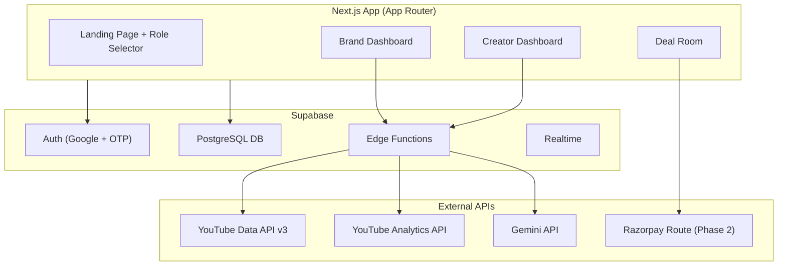

# 🎙️ Vaani — Updated Implementation Plan
### Real APIs from Day 1 · Feature-by-Feature Frontend Build

---

## Current State

| Asset | Status |
|---|---|
| **PRD** (`PRD_Vaani.md`) | ✅ Complete spec — VVS formula, architecture, API stack, user journeys |
| **UI Mockup** (`vaani-creator-marketplace.jsx`) | ✅ 52KB single-file React prototype — all screens, scoring logic, 8 mock creators |
| **Strategy Docs** (Problem statement, personas, segmentation) | ✅ Research complete |
| **Project Scaffold** (Next.js, package.json, routing) | ✅ Built — `vaani-app/` |
| **Design System** (`globals.css`) | ✅ Dark chocolate + gold luxury theme |
| **Landing Page** | ✅ Built — animated mic, floating ghost cards, role cards |
| **Authentication** | ✅ Built — Phone OTP + Google OAuth + middleware |
| **Onboarding** | ✅ Built — role selector page |

**Goal**: Build a production-quality Next.js app with **real API integrations** from the start. Frontend first, wired to Supabase + YouTube + Gemini APIs progressively.

---

## Decisions Confirmed

| Decision | Answer |
|---|---|
| Authentication | ✅ Both Google OAuth + Phone OTP via Supabase Auth |
| Deployment | ✅ Keep local for now (no Vercel config yet) |
| Data Source | ✅ **Real APIs** — YouTube Data API, Gemini API, Supabase DB |
| Color Theme | ✅ Dark chocolate brown (`#2C1509`) + gold (`#C9A96E`) luxury theme |
| VVS Weights | ✅ PRD weights — A:25%, D:20%, L:25%, T:15%, C:15% |
| Supabase Project | ✅ Created — Seoul region |
| Supabase URL | ✅ `https://lxwsxciqsoornfkowgpn.supabase.co` |

---

## Tech Stack (Confirmed)

| Layer | Technology |
|---|---|
| **Framework** | Next.js 16+ (App Router, React Server Components) |
| **Styling** | Vanilla CSS with CSS Modules (dark chocolate + gold luxury theme) |
| **Charts** | Recharts |
| **Icons** | Lucide React |
| **Auth** | Supabase Auth (Google OAuth + Phone OTP) |
| **Database** | Supabase PostgreSQL |
| **AI/NLP** | Gemini API (regional comment NLP, scoring, counter-offer generation) |
| **Creator Data** | YouTube Data API v3 + YouTube Analytics API |
| **Payments** | Razorpay Route (Phase 2) |
| **Fonts** | Bricolage Grotesque (headings), Public Sans (body), IBM Plex Mono (metrics), Noto Sans regional fonts |

---

## Architecture Overview



---

## Database Schema (Supabase PostgreSQL)

```sql
-- Core tables
profiles (id, user_id, role, name, email, phone, avatar_url, created_at)
creators (id, user_id, name, handle, language, district, state, tier, niche,
          youtube_channel_id, instagram_handle, followers, avg_views,
          engagement_rate, bot_pct, cpm, current_rate, vvs_score,
          cohort, cohort_size, percentile, repeat_viewers,
          female_pct, core_age, flags[], created_at, updated_at)
brands (id, user_id, company_name, gst_number, website, category,
        budget_range, target_languages[], target_regions[], verified, created_at)
vvs_scores (id, creator_id, authenticity, depth, locality, trust,
            conversion, total_score, calculated_at)
audience_audit (id, creator_id, districts_json, language_breakdown_json,
                bot_analysis_json, comment_analysis_json, audited_at)
deals (id, brand_id, creator_id, campaign_name, offer_amount, fair_rate,
       counter_amount, status, deliverables, timeline, escrow_status, created_at)
campaigns (id, brand_id, name, budget, target_languages[], objectives,
           status, created_at)
campaign_creators (id, campaign_id, creator_id, offer_amount, status)
```

---

## Feature-by-Feature Build Plan

> [!TIP]
> Each feature below is a self-contained unit. Built one at a time with user confirmation before moving to the next.

---

### ✅ Feature 1: Project Scaffold + Design System — COMPLETE
- Next.js 16+ initialized in `vaani-app/`
- Full folder structure (app/, lib/, public/)
- `globals.css` — dark chocolate + gold luxury design system
- Supabase client (`lib/supabase.js`)
- VVS scoring engine (`lib/scoring.js`)
- NL search parser (`lib/search-parser.js`)
- Constants + utils (`lib/constants.js`, `lib/utils.js`)
- `.env.local` wired with Supabase credentials

**Build result**: ✅ 0 errors, 16 routes

---

### ✅ Feature 2: Authentication (Google + Phone OTP) — COMPLETE
- Login page (`app/login/`) — luxury gold/brown UI
- Google OAuth via Supabase Auth
- Phone OTP flow (+91 prefix)
- Auth callback route (`app/auth/callback/route.js`)
- Onboarding page (`app/onboarding/`) — role selector (Brand / Creator)
- Route protection middleware (`middleware.js`)
- Profiles table in Supabase PostgreSQL

**Build result**: ✅ 0 errors, middleware active

---

### 🔜 Feature 3: Layout Shells (Sidebar + TopBar)
**What gets built:**
- **Brand layout** (`app/brand/layout.js`): Collapsible sidebar (Discover, Deals, Campaigns, Settings), top bar with brand name + notifications + avatar
- **Creator layout** (`app/creator/layout.js`): Sidebar (My Dashboard, Offers, Profile, Settings), top bar
- Mobile-responsive hamburger menu
- Active route highlighting
- Role-based route protection (brands can't access `/creator` and vice versa)

**Deliverable**: Dashboard shells with navigation, ready for page content.

---

### Feature 4: Landing Page (Final Polish)
**What gets built:**
- Current landing page is Feature 1 placeholder
- Hero with final copy, animations, CTA buttons routing to `/login`
- Value proposition section
- Mobile responsive

---

### Feature 5: Creator Onboarding + YouTube API Integration
**What gets built:**
- Creator profile setup form (name, language, niche, district, state)
- YouTube OAuth flow — connect YouTube channel via API
- Automated data fetch using YouTube Data API v3
- Data stored in Supabase

**Real APIs used**: YouTube Data API v3

---

### Feature 6: AI Audience Audit (Gemini NLP)
**What gets built:**
- Gemini API integration for regional comment analysis
- Language detection, intent classification, bot detection
- Results stored in `audience_audit` table

**Real APIs used**: Gemini API, YouTube Data API

---

### Feature 7: VVS Scoring Engine + Fair Rate Calculator
**VVS Formula (PRD weights):**
```
VVS = 0.25×Authenticity + 0.20×Depth + 0.25×Locality + 0.15×Trust + 0.15×Conversion
```
**Fair Rate Formula:**
```
effectiveReach = avgViews × (1 - botPct/100)
baseRate = (effectiveReach / 1000) × CPM
qualityMultiplier = 0.75 + (VVS/100) × 0.70
fairRate = round((baseRate × qualityMultiplier × 1.15) / 500) × 500
```

---

### Feature 8: Creator Dashboard — My Value Dashboard + Gap Bar
- The Gap Bar (signature feature)
- VVS Score card with pillar breakdown
- Fair Rate breakdown card
- Score Boost Actions

---

### Feature 9: Brand Dashboard — AI Discovery Engine
- Natural Language Search Bar
- Filter chips (Language, Niche, Region, VVS, Tier)
- Creator Grid with VVS badges
- Sort + preset suggestions

---

### Feature 10: Creator Profile Detail View (Brand Side)
- Full profile with VVS breakdown
- Comment analysis section (native script + intent tags)
- Geographic audience distribution
- CTA → Deal Room

---

### Feature 11: Deal Room + Negotiation Flow
- Campaign creation form
- 6-stage pipeline indicator
- Interactive offer slider with fair band evaluation
- Contract terms + escrow status

---

### Feature 12: Creator Offers + AI Counter Suggester
- Incoming offers list
- AI Counter Suggester (Gemini-powered)
- Accept / Counter / Decline flow

---

### Feature 13: Campaign Dashboard + Outcome Tracking
- Live performance metrics (Recharts)
- Regional cohort benchmarking
- District-level reach breakdown

---

### Feature 14: Polish, Responsive Design + Animations
- Mobile responsive pass (375px → 1440px)
- Micro-animations, loading skeletons
- Error states, toast notifications
- Accessibility + performance pass

---

## Build Progress

| Feature | Status |
|---|---|
| 1 — Scaffold + Design System | ✅ Complete |
| 2 — Authentication | ✅ Complete |
| 3 — Layout Shells | 🔜 Next |
| 4 — Landing Page Polish | ⬜ Pending |
| 5 — YouTube API | ⬜ Pending |
| 6 — AI Audience Audit | ⬜ Pending |
| 7 — VVS Engine | ⬜ Pending |
| 8 — Creator Dashboard | ⬜ Pending |
| 9 — Brand Discovery | ⬜ Pending |
| 10 — Creator Profile Detail | ⬜ Pending |
| 11 — Deal Room | ⬜ Pending |
| 12 — Offers + Counter | ⬜ Pending |
| 13 — Campaign Dashboard | ⬜ Pending |
| 14 — Polish + Responsive | ⬜ Pending |
